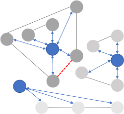

# Virtual Nodes Revisited

**TL;DR**
We propose new methods for extending GNNs with multiple (!) virtual nodes for link prediction.


<p align="center">



</p>


Virtual nodes are well known to often improve the graph classification performance of graph neural networks, where a single artificial virtual node is added to every graph and connected to all nodes in the graph [1,2,3,4]. 

**We propose to use multiple virtual nodes in the link prediction scenario and describe a graph-based technique to connect them to the graph nodes.** 
In a nutshell, we use a graph clustering algorithm to determine groups of nodes in the graph that belong together and then connect these nodes to the same virtual node. In this way, under-reaching is decreased because clustered nodes can share information easily; at the same time, the nodes are spared of unnecessary information from unrelated nodes (i.e., in contrast to the single virtual node model).
More details are given in [our paper](./paper.pdf).
## Installation
* Tested with Python 3.8, PyTorch 1.8.1., and PyTorch Geometric 1.6.3.
* Set up an Anaconda environment: `./setup.sh` 
<br/>(see comments in script)
<br/> Also, you need to have installed [Anaconda](https://www.anaconda.com/products/individual#Downloads). See its [Installation instructions](https://docs.anaconda.com/anaconda/install/).
* Alternatively, install the above and the packages listed in [requirements.txt](requirements.txt)

## Data

* We used the link prediction datasets from the [Open Graph Benchmark](https://ogb.stanford.edu/). 
* When running the first time with a new dataset, the code will first download and preprocess the data. It will reuse these files with later runs.


## Example Command
To run GCN extended with 1 virtual node (aka. `GCN-VN`) over `ogbl-ddi` run:
    
`python src/ogbl_ddi.py --data_dir=data --model=gcn-vn --vns=1 --vn_idx=full`

For all possible parameter options see [here](./src/utils/parser.py).
<br/>Please leave an issue if you have any trouble running the code.

## Paper

If the code is helpful for your project, please cite [our paper](./paper.pdf) (Bibtex below).
```
@article{hwang2021vns,
  title={Revisiting Virtual Nodes in Graph Neural Networks for Link Prediction},
  author={EunJeong Hwang, Veronika Thost, Shib Sankar Dasgupta, Tengfei Ma},
  journal={arXiv preprint arXiv:2005.00687}, TBD
  year={2020}
}
```

## References

* [1] Gilmer et al. [Neural Message Passing for Quantum Chemistry](https://arxiv.org/pdf/1704.01212.pdf), ICML 2017.
* [2] Li et al. [Learning Graph-Level Representation for Drug Discovery](http://arxiv.org/abs/1709.03741), arXiv preprint 2017.
* [3]  Pham et al. [Graph Classification via Deep Learning with Virtual Nodes](https://arxiv.org/pdf/1708.04357.pdf), arXiv preprint 2017.
* [4]  Ishiguro et al. [Graph Warp Module: an Auxiliary Module for Boosting the Power of Graph Neural Networks](https://arxiv.org/pdf/1902.01020.pdf), arXiv preprint 2019.


